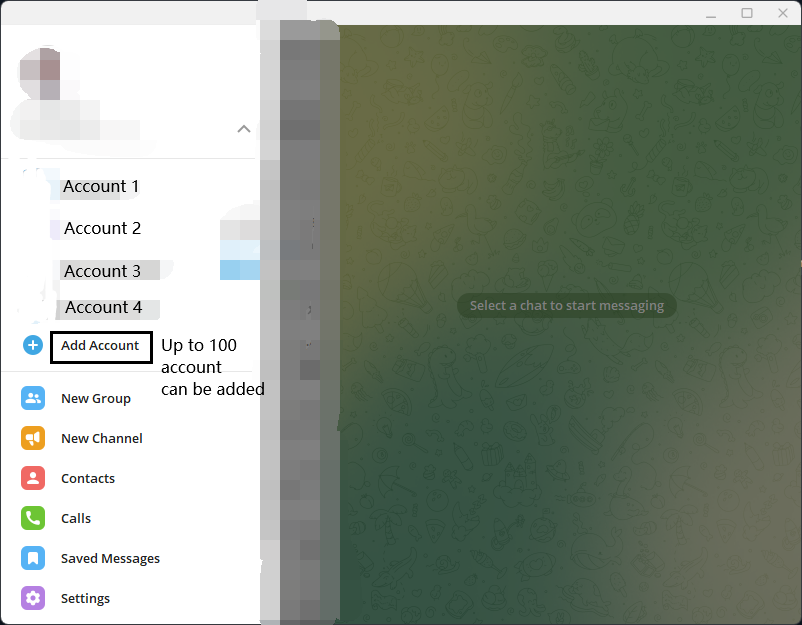

# Multigram
A third-party build of [Telegram Apps](https://telegram.org/apps), which remains exactly the same as the official client except raising the limit of number of accounts.

## Current Version
|Upstream Project|Latest Build|Next Build(Expected)|
|---|---|---|
|[Telegram Desktop](https://github.com/telegramdesktop/tdesktop)|`v3.7.1`|`v3.8.x`|
|[Telegram Android](https://github.com/DrKLO/Telegram)|`v8.7.2`|`v8.8.x`|
|[Telegram Swift](https://github.com/overtake/TelegramSwift)|`❌Build Failed`|`---`|

## Changes from the official client
- [Telegram Desktop](https://github.com/telegramdesktop/tdesktop): Raised the maximum number of accounts from 3 to 100.
- [Telegram Android](https://github.com/DrKLO/Telegram): Raised the maximum number of accounts from 3 to 16.

## Screenshot

## Platform Support
|OS|Status|Supported Arch|Upstream Project|
|---|---|---|---|
|Windows|✅|amd64|[Telegram Desktop](https://github.com/telegramdesktop/tdesktop)|
|macOS|✅|x64|[Telegram Desktop](https://github.com/telegramdesktop/tdesktop)|
|Linux|✅|amd64|[Telegram Desktop](https://github.com/telegramdesktop/tdesktop)|
|Android|✅|arm64/x86_64/x86|[Telegram Android](https://github.com/DrKLO/Telegram)|
|iOS|-| | |

This third-party client is built mainly for personal use, so currently only Windows clients are (not very actively) being built and maintained to get synced with offcial client. Send an issue if you need builds of othre platforms or updates for Windows clients.

## Other third-party clients that support multiple accounts

| Name | Supported Platform | Maximum Number of Accounts |
| --- | --- | --- |
| [Unigram](https://github.com/UnigramDev/Unigram) | Windows 10 + | Unlimited (Maybe) |
| [Nekogram X](https://github.com/NekoX-Dev/NekoX) | Android | Unlimited |
| [Nicegram](https://nicegram.app) | iOS / Android | 7 |
